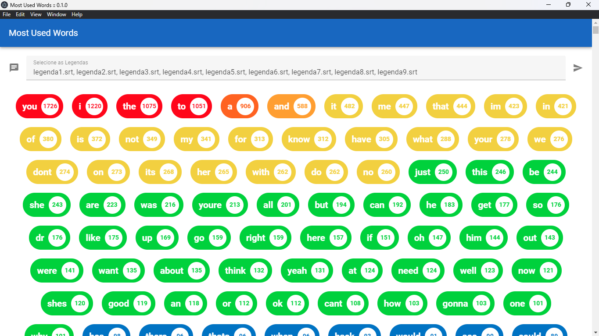

# project-most-used-words

Aplicação Desktop com interface gráfica que processa arquivos de legendas (.srt) fornecidos pelo usuário e exibe a quantidade de vezes que cada palavra apareceu, em ordem decrescente e personalizável.


Tecnologias:
+ Electron JS
+ Vue JS
+ Javascript

Preview:



## Project setup
```
npm install
```

### Compiles and hot-reloads for development
```
npm run serve
```

### Compiles and minifies for production
```
npm run build
```

### Lints and fixes files
```
npm run lint
```

### Customize configuration
See [Configuration Reference](https://cli.vuejs.org/config/).
